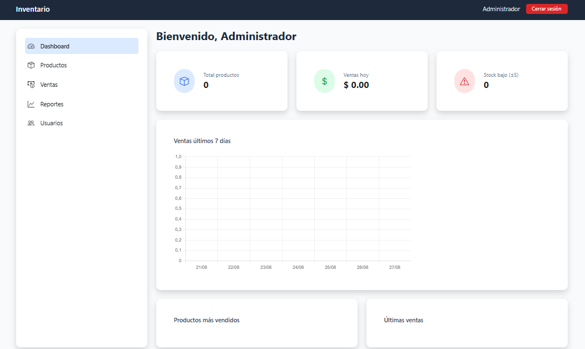
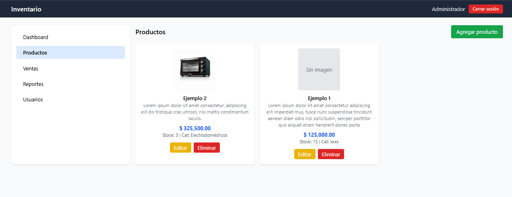
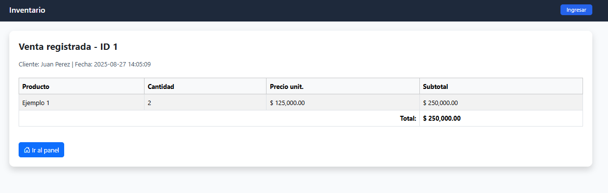
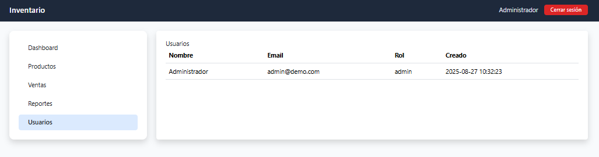
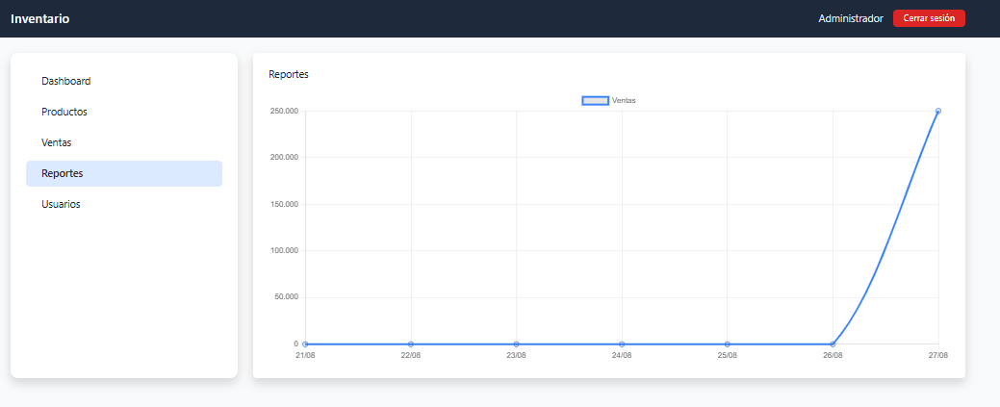

# 📦 Sistema de Inventario y Ventas

Aplicación web para la gestión de productos, inventario y ventas, desarrollada en **PHP**, **MySQL** y **Bootstrap + TailwindCSS**.

---

## 🚀 Características

- 🔐 Sistema de login y autenticación de usuarios  
- 📊 Panel de administración con productos, stock y precios  
- ➕ Agregar productos con imagen  
- ✏️ Editar y eliminar productos  
- ❌ Eliminar productos fácilmente  
- 🖼️ Visualización de productos con diseño moderno  
- 🎠 Carrusel de imágenes para destacar productos o promociones  
- 📂 Estructura modular (separación por `modules/`, `includes/`, `config/`)

---

## ⚙️ Requisitos

- XAMPP (PHP + Apache + MySQL)  
- Composer (opcional, si usás librerías adicionales)  
- Git para clonar el repositorio  

---

## 🎠 Carrusel de imágenes

html

  

    

      
    

    

      
    

    

      
    

    

      < booking src="imagen4.png" class="d-block w-100" alt="Producto 4">
    

    

      
    

    

      
    

  

  <button class="carousel-control-prev" type="button" data-bs-target="#carouselProductos" data-bs-slide="prev">
    
  </button>
  <button class="carousel-control-next" type="button" data-bs-target="#carouselProductos" data-bs-slide="next">
    
  </button>

