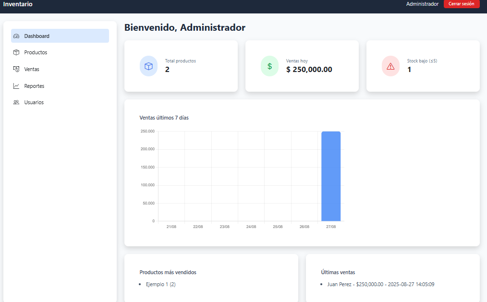

# 📦 Sistema de Inventario y Ventas

Aplicación web para la gestión de productos, inventario y ventas, desarrollada en **PHP**, **MySQL** y **Bootstrap + TailwindCSS**.

---

## 🚀 Características

- 🔐 Sistema de login y autenticación de usuarios  
- 📊 Panel de administración con productos, stock y precios  
- ➕ Agregar productos con imagen  
- ✏️ Editar y eliminar productos  
- ❌ Eliminar productos fácilmente  
- 🖼️ Visualización de productos con diseño moderno  
- 🎠 Carrusel de imágenes para destacar productos o promociones  
- 📂 Estructura modular (separación por `modules/`, `includes/`, `config/`)

---

## ⚙️ Requisitos

- XAMPP (PHP + Apache + MySQL)  
- Composer (opcional, si usás librerías adicionales)  
- Git para clonar el repositorio  

---

## 📷 Galeria de Imágenes

<!-- Carousel de Productos -->

  <!-- Contenedor de los items del carousel -->
  

    <!-- Primer producto -->
    

      
    

    <!-- Segundo producto -->
    

      
    

    <!-- Tercer producto -->
    

      
    

    <!-- Cuarto producto -->
    

      
    

    <!-- Quinto producto -->
    

      
    

    <!-- Sexto producto -->
    

      
    

  

---

